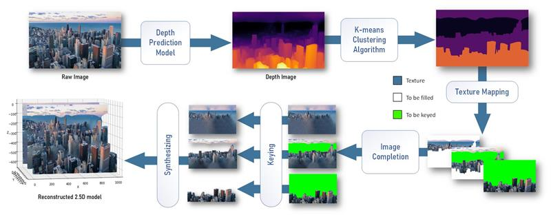

# Synthesis of 2.5D Models Based on Monocular Images

## 1. Introduction
With the development of Computer Graphics technology as well as deep learning technology, it has become possible to convert 2D images into 3D models using computer algorithms. In the past few years, many implementations of 3D reconstruction techniques have been proposed, some of which have been widely used in areas such as film and television entertainment, intelligent homes, heritage reconstruction, and autonomous driving and etc. A common method to reconstruct a 3D model is to place multiple depth cameras around an object and capture images simultaneously, and then reconstruct the 3D shape of the object based on the captured images. However, since most systems based on this approach require multiple cameras and synchronization devices, it is difficult for most users to use these systems flexibly. In addition, modeling a 3D scene is generally very complex and time-consuming. Especially in distant scenes that do not require much detail, it is not worth spending much time modeling the scene.

The data acquisition process required for 2.5D reconstruction is simpler and more economical than that for 3D reconstruction. It typically uses 2D images as input without the complex equipment architecture, which makes it more attractive for individual users, small teams or projects with limited resources. In addition, 2.5D reconstruction is normally faster to process, which makes it practical in applications that require quick results, such as real time surveillance, virtual reality and augmented reality. Hence, in this project, I propose and implement a 2.5D reconstruction method based on monocular camera with user-defined complexity, aiming to make it easier for users to get hands-on and reconstruct the scene model quickly.

## 2. 2.5D Reconstruction System
The overview diagram is shown in Figure below.

## 3. Conclusion
This project presents a system for synthesizing 2.5D models from monocular 2D images. My approach allows users to customize the number of layers and the distance between layers based on the complexity of the input image. In addition, the system does not require complex hardware devices and can be easily used by general users with 3D software. In the future, I will continue to optimize the performance of the system and hope that the proposed system will help the development of industries such as film and entertainment and medical care.

